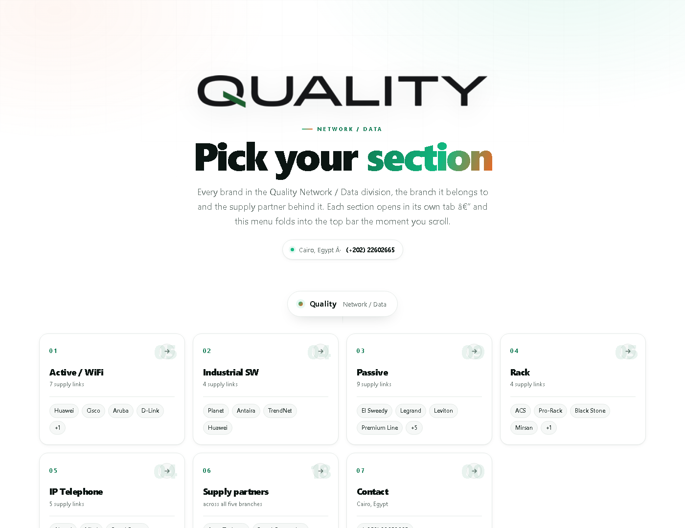

# Quality Network — Network / Data

[](https://seifmomo.github.io/quality-network-map/)
[](https://github.com/seifmomo/quality-network-map)
[](#the-tabs)

### ➜ **Live: https://seifmomo.github.io/quality-network-map/**



A clean white-canvas site for the **Quality Network / Data** division.
Every section is its own tab (page), and the hero carries the Quality logo above a
**connector tree** that folds away into a slim top bar as soon as you scroll.

| Tab | Page | Contents |
| --- | --- | --- |
| Home | `index.html` | Logo hero, section tree, at-a-glance strip, full map overview, brand wall |
| Active / WiFi | `active.html` | Huawei, Cisco, Aruba, D-Link, TP-Link |
| Industrial SW | `industrial.html` | Planet, Antaira, TrendNet, Huawei iMaster |
| Passive | `passive.html` | Legrand, Leviton, Panduit, Datwyler, CommScope, Pro Link, Black Stone, El Sweedy, Premium Line |
| Rack | `rack.html` | ACS, Pro-Rack, Black Stone, Mirsan, ESTAP |
| IP Telephone | `phone.html` | Alcatel, Mitel, Grand Steem, Avaya |
| Supply partners | `supply.html` | All 18 partners + the branches each one serves |
| Contact | `contact.html` | Phone, email, address, website, enquiry form |

**5 branches · 27 brand entries · 18 supply partners · 4 direct-supply brands**

---

## The hero selector

1. The **Quality logo** sits centred at the top of the hero (`img/quality-logo.png`).
2. A pill-shaped **hub** — *Quality · Network / Data* — anchors a **connector tree**: curved
   SVG lines are drawn from the hub down to every section card, animated stroke by stroke.
3. Each card shows its index, title, count and the first brands; hovering a card lights its
   connector line.
4. Scrolling — or pressing `Esc`, `↓`, `PageDown` — collapses the tree and slides the slim top
   bar back in, so navigation is always one click away.

## The tabs

Every tab is a real page: it opens in its own browser tab, the URL can be shared or
bookmarked, and each page ends with **previous / next tab** links. The bar marks the current
tab.

## Layout

```
index.html  active.html  industrial.html  passive.html
rack.html   phone.html   supply.html      contact.html
assets/data.js             content — the single source of truth
assets/app.js              rendering, bar, hero tree, reveals, form
assets/style.css           design system
assets/icon.svg            tab icon (green tile + Quality swoosh)
assets/apple-touch-icon.png
img/quality-logo.png       Quality logo (dark, for the white UI)
img/brand-wall.jpg
img/preview.png
```

## Design

- White canvas, emerald `#0F7A52` / `#12B981` accent with a warm `#F26522` highlight.
- Hairline `#E3E9E6` borders, soft shadows, glass-free and print-friendly.
- Motion: hero logo pop-in, staggered card reveals, drawn SVG connectors, hover sweeps,
  one-shot fade-in on scroll, animated scroll-progress line.
- No build step, no dependencies: static HTML + CSS + vanilla JS.
- `prefers-reduced-motion` respected; print stylesheet included.

## Content

Transcribed from the Quality Network mind map (`Quality → Network / Data`). Spellings kept as
supplied (`Grand Steem`, `El Con Novd`, `Intepris / E-Kit`); `Brand-Connection` normalised to
`Brand Connection` and `Silicon21 + Middle East` split into `Silicon 21` and `Middle East`.

## Licence

© Quality Egyptian Engineering Projects Co. — Cairo, Egypt.